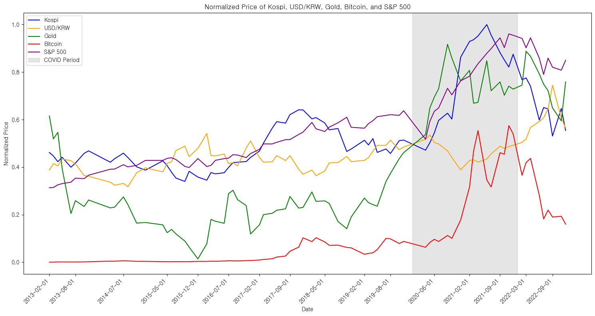
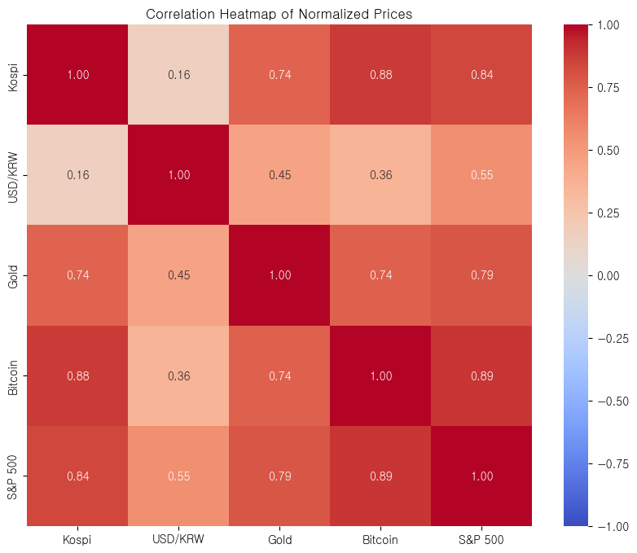

# SKN09 - EDA 3Team

> **SK Networks AI CAMP 9기**  
> **개발기간:** 2025.01.15 ~ 2025.01.20  
> **팀명:** 경제 콜럼버스  

---

## 📢 Team Introduction (팀 소개)

### 팀명 : **경제 콜럼버스 (SKN09-eda-3Team)**

#### 팀원 (GitHub Links)
- [김정훈](https://github.com/Zayden0815)
- [김하늘](https://github.com/nini12091)
- [이광운](https://github.com/Leegwangwoon)
- [정윤경](https://github.com/kinoble)

---

## 🎯 Data Analysis (데이터 분석)

snp와 BTC는 전체적으로 우상향 그래프를 그리며, 서로 비슷한 움직임 양상을 보임

(그래프 해석 설명 필요)

---
#### 5개 주요 항목(S&P 500, KOSPI, 비트코인, 금, 환율)에 대한 가격 변동 (**pt_version.ipynb**)

#### S&P 500, 금(Gold) 변동 분석 (**lgw/snp_btc.ipynb**)

---
#### 비트코인(BTC), 금(Gold) 자산 분석 (**sky/eda_final.ipynb**)
##### 금 가격과 비트코인 변동성 비교 / 경제 위기의 기간 동안의 트랜드 분석
   
   
   
   
   
   
   
   
   

---
#### 비트코인(BTC), 환율(USD/KRW), KOSPI 지수 변동 분석
(**kjh/01.BTC_data.ipynb**, **kjh/02.USD_KRW.ipynb**, **kjh/03.KOSPI.ipynb**, **kjh/04.mini_project_zayden.ipynb**)

## 📝 Conclusion (결론)
### EDA를 통해 관찰한 주요 사항
- (작성 필요)

---

## 💬 Team Reflection (한 줄 회고)
- **김정훈**: (작성 필요)
- **김하늘**: (작성 필요)
- **이광운**: 수집 기간과 변동폭이 서로 다른 항목에 스케일링 필요성과 같은 데이터라도 결과를 강조하거나 희석시키는 방식이 가능함을 관찰.
- **정윤경**: (작성 필요)

---
